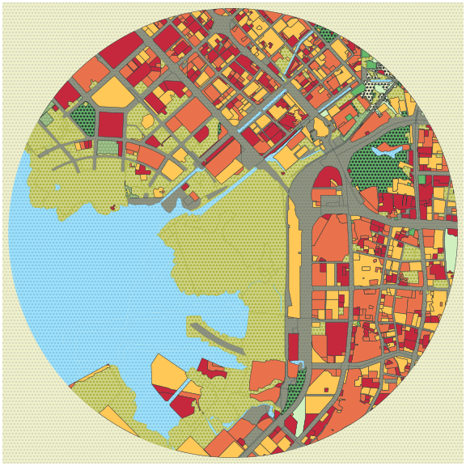
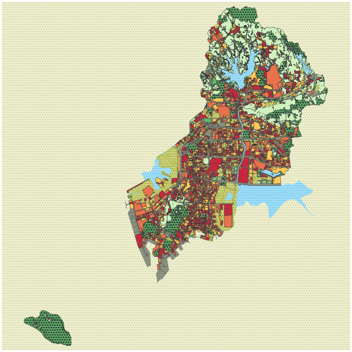

# Pretty GeoDataFrame


A python function to draw pretty geodataframe.

Based on *matplotlib*, *shapely*, *descartes*.


## Installation

just use the *plot_gdf* function

## Usage example


We provide example data in *sample_data* directory.


```python

from plot_gdf import gdf

gdf = gpd.read_file('./sample_data/sample_land_use_circle.shp')
drawing_kwargs = {
    'background': {'fc': '#F2F4CB', 'ec': '#dadbc1', 'hatch': 'ooo...', 'zorder': -1},
    
    'Water': {'fc': '#a1e3ff', 'ec': '#2F3737', 'hatch': 'ooo...', 'hatch_c': '#85c9e6', 'lw': 0, 'zorder': 2},
    
    'Transportation': {'fc': '#2F3737', 'ec': '#475657', 'alpha': 0.5, 'lw': 0.5, 'zorder': 2},
    
    'Others': {'fc': '#D2D68D', 'ec': '#AEB441', 'lw': .5, 'zorder': 3, 'hatch': 'ooo...'},
    
    'Farmland': {'fc': '#F2F4CB', 'ec': '#2F3737', 'lw': .5, 'zorder': 3, 'hatch': 'ooo...'},
    'Field': {'fc': '#D0F1BF', 'ec': '#2F3737', 'lw': .5, 'zorder': 3},
    
    'Special': {'fc': '#64B96A', 'ec': '#2F3737', 'lw': .5, 'zorder': 3},
    
    'Forest': {'fc': '#64B96A', 'ec': '#2F3737', 'lw': .5, 'hatch': 'ooo...', 'zorder': 3},
    'Grass': {'fc': '#8BB174', 'ec': '#2F3737', 'hatch_c': '#A7C497', 'hatch': 'ooo...', 'lw': .5, 'zorder': 3},
    

    'Public': {'palette': ['#FFC857', '#E9724C', '#C5283D'], 'ec': '#2F3737', 'lw': .5, 'zorder': 4},
    'Residential': {'palette': ['#FFC857', '#E9724C', '#C5283D'], 'ec': '#2F3737', 'lw': .5, 'zorder': 4},
    'Industrial': {'palette': ['#FFC857', '#E9724C', '#C5283D'], 'ec': '#2F3737', 'lw': .5, 'zorder': 4},
    'Commercial': {'palette': ['#FFC857', '#E9724C', '#C5283D'], 'ec': '#2F3737', 'lw': .5, 'zorder': 4},
}
fig, ax = plt.subplots(figsize = (8, 8), constrained_layout = True)
plot_gdf(gdf, ax, field='major', drawing_kwargs=drawing_kwargs)
plt.savefig('./test.png')

```


## another sample




## reference

inspired by https://github.com/marceloprates/prettymaps


------

# 漂亮的GeoDataFrame

在这个仓库，我们提供了一个简单的python函数来绘制漂亮的GeoDataFrame。这个函数构建在3个现有的库上即*matplotlib*, *shapely*, *descartes*。

## 安装

你可以直接复制*plot_gdf*函数来使用这个库

## 使用例子

参照 Usage example. 你需要为函数提供一个GeoDataFrame,指定用于绘图的column名，以及绘图的参数。 


## 参考

这个仓库是受到https://github.com/marceloprates/prettymaps的启发而编写的。
*marceloprates*的工作合并了数据获取和可视化，但是如果你已经有了地理数据，那么可以直接使用本仓库来进行绘制。